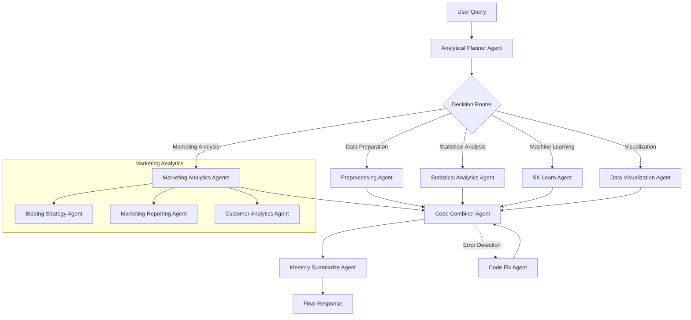

# AI-Powered Analytics System

A sophisticated Flask-based web application that provides AI-powered data analytics capabilities through multiple specialized agents.

## Features

- 🤖 Multiple AI Agents for different analytics tasks
- 📊 Advanced data visualization capabilities
- 📈 Statistical and machine learning analysis
- 🎯 Marketing analytics specialization
- 💾 Persistent storage with SQLite
- 🔍 Vector search capabilities
- 🔄 RESTful API interface
- 🐳 Docker support

## System Requirements

- Python 3.11+
- Flask
- SQLAlchemy
- DSPy
- LlamaIndex
- OpenAI API key
- Docker (optional)
- Docker Compose (optional)
- Other dependencies (see `requirements.txt`)

## Installation

### Standard Installation

1. Clone the repository:
```bash
git clone <repository-url>
cd <repository-name>
```

2. Create and activate a virtual environment:
```bash
python -m venv venv
source venv/bin/activate  # On Windows: venv\Scripts\activate
```

3. Install dependencies:
```bash
pip install -r requirements.txt
```

4. Set up environment variables:
```bash
cp .env.example .env
# Edit .env with your OpenAI API key and other configurations
```

5. Initialize the database:
```bash
flask db upgrade
```

### Docker Installation

1. Clone the repository:
```bash
git clone <repository-url>
cd <repository-name>
```

2. Set up environment variables:
```bash
cp .env.example .env
# Edit .env with your OpenAI API key and other configurations
```

3. Build and start the Docker containers:
```bash
docker-compose up --build
```

The application will be available at `http://localhost:5000`

### Docker Commands

- Start the application:
```bash
docker-compose up
```

- Start in detached mode:
```bash
docker-compose up -d
```

- Stop the application:
```bash
docker-compose down
```

- View logs:
```bash
docker-compose logs -f
```

- Rebuild the container:
```bash
docker-compose up --build
```

## Project Structure

```
.
├── flask_app.py          # Main application entry point
├── routes.py            # API endpoints and routing
├── db_models.py         # Database models
├── agents.py           # Core AI agents
├── memory_agents.py    # Memory management agents
├── retrievers.py       # Data retrieval and preprocessing
├── marketing_analytics_agents.py  # Marketing specific agents
├── requirements.txt    # Project dependencies
└── .env               # Environment variables
```

## Available Agents

### Core Analytics Agents
- **Analytical Planner**: Routes queries to appropriate agents
- **Preprocessing Agent**: Handles data preprocessing tasks
- **Statistical Analytics Agent**: Performs statistical analysis
- **SK Learn Agent**: Handles machine learning tasks
- **Data Visualization Agent**: Creates data visualizations
- **Story Teller Agent**: Generates analysis narratives
- **Code Combiner Agent**: Combines code from multiple agents
- **Code Fix Agent**: Fixes faulty code

### Memory Agents
- **Memory Summarize Agent**: Summarizes agent responses
- **Error Memory Agent**: Handles error analysis and correction

### Marketing Analytics Agents
- **Bidding Strategy Agent**: Optimizes bidding strategies
- **Marketing Reporting Agent**: Generates marketing reports
- **Customer Analytics Agent**: Analyzes customer behavior

## API Endpoints

### Data Management
- `POST /upload_dataframe`: Upload a new dataset
- `GET /health`: Check system health

### Query Management
- `GET /queries`: List all queries
- `GET /queries/<id>`: Get specific query
- `GET /responses`: List all responses
- `GET /responses/query/<query_id>`: Get responses for a query

### Chat Endpoints
- `POST /chat/<agent_name>`: Chat with specific agent
- `POST /chat`: Chat with all agents

## Usage Examples

### Upload a Dataset
```python
import requests
import pandas as pd

df = pd.read_csv('your_data.csv')
response = requests.post('http://localhost:5000/upload_dataframe', 
                        json={'file': df.to_json()})
```

### Chat with an Agent
```python
response = requests.post('http://localhost:5000/chat/data_viz_agent',
                        json={'query': 'Create a histogram of sales data'})
```

### Get All Responses
```python
responses = requests.get('http://localhost:5000/responses').json()
```

## Configuration

The system can be configured through environment variables:

```env
OPENAI_API_KEY=your-api-key
FLASK_ENV=development
FLASK_APP=flask_app.py
DATABASE_URL=sqlite:///response.db
```

## Development

### Running Tests
```bash
python -m pytest tests/
```

### Starting the Development Server
```bash
flask run --debug --port 5000
```

## Data Visualization Styling

The system includes predefined styling for various chart types:
- Line charts
- Bar charts
- Histograms
- Pie charts
- Heat maps

Each chart type follows consistent styling guidelines for:
- Templates
- Axis formatting
- Number formatting (K/M for thousands/millions)
- Chart dimensions
- Annotations

## Contributing

1. Fork the repository
2. Create your feature branch (`git checkout -b feature/AmazingFeature`)
3. Commit your changes (`git commit -m 'Add some AmazingFeature'`)
4. Push to the branch (`git push origin feature/AmazingFeature`)
5. Open a Pull Request

## License

This project is licensed under the MIT License - see the LICENSE file for details.

## Acknowledgments

- OpenAI for GPT-4 integration
- LlamaIndex for vector store capabilities
- Flask team for the web framework
- SQLAlchemy team for the ORM

## Agent Workflow

### System Architecture and Agent Flow



### Workflow Steps

1. **Query Reception and Planning**
   - User submits a query
   - Analytical Planner Agent analyzes the request
   - Planner determines which agents to involve

2. **Task Distribution**
   - Queries can be routed to specialized agents:
     - Preprocessing Agent: Data cleaning and preparation
     - Statistical Analytics Agent: Statistical analysis
     - SK Learn Agent: Machine learning tasks
     - Data Visualization Agent: Creating charts and plots
     - Marketing Analytics Agents: Marketing-specific analysis

3. **Marketing Analytics Specialization**
   - Bidding Strategy Agent: Optimizes marketing campaigns
   - Marketing Reporting Agent: Generates comprehensive reports
   - Customer Analytics Agent: Analyzes customer behavior

4. **Code Processing**
   - Code Combiner Agent merges outputs from different agents
   - Code Fix Agent handles any errors or inconsistencies
   - Memory Summarize Agent creates response summaries

5. **Response Generation**
   - Final response is formatted and returned to user
   - Results are stored in database for future reference

### Agent Interaction Examples

1. **Data Analysis Flow**:
```
User Query -> Planner -> Preprocessing -> Statistical Analysis -> Visualization -> Response
```

2. **Marketing Campaign Flow**:
```
User Query -> Planner -> Marketing Analytics -> Bidding Strategy -> Reporting -> Response
```

3. **Machine Learning Flow**:
```
User Query -> Planner -> Preprocessing -> SK Learn -> Visualization -> Response
```

### Error Handling and Memory

- **Error Detection and Correction**
  - Code Fix Agent monitors for errors
  - Automatic error correction when possible
  - Error logging for future improvements

- **Memory Management**
  - Memory Summarize Agent maintains context
  - Previous interactions are stored
  - Responses are cached for efficiency

### Agent Communication Protocol

1. **Query Phase**
   - Input validation
   - Context gathering
   - Agent selection

2. **Processing Phase**
   - Data transformation
   - Analysis execution
   - Result generation

3. **Integration Phase**
   - Code combination
   - Error checking
   - Response formatting

4. **Memory Phase**
   - Context storage
   - Response caching
   - Learning updates

### Performance Considerations

- Parallel processing when possible
- Caching of frequent operations
- Resource allocation optimization
- Query prioritization
- Response time monitoring 
